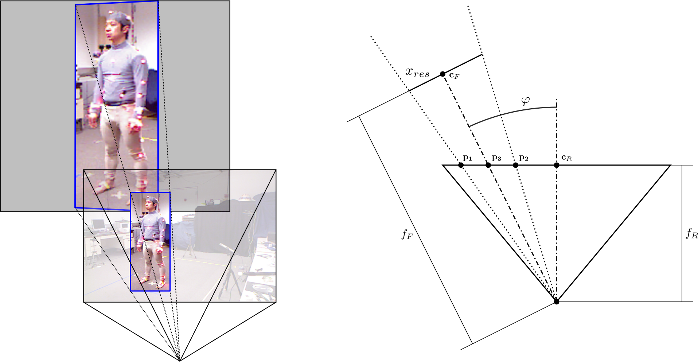

# HPE3D - Human Pose Estimation in 3D

Code repository for 3D Human Pose Estimation in the Wild. You can find the scientific report [here](hpe3d_report.pdf).



## Installation instructions
Our code was implemented and testet on Ubuntu 18.04 and 16.04 with `python >= 3.7`. It requires pytorch and supports GPU inference (based on [SPIN](https://github.com/nkolot/SPIN)). Our method to remap the images with physically accurate perspective distortion, as well as acquire 3D poses in global world coordinates supports both GPU and CPU computations.

To get started, clone the repository

```
git clone https://github.com/dorianhenning/hpe3d.git
```
In addition, you need the SMPL body models. For this, please register [on their website](http://smplify.is.tue.mpg.de/), accept their license and download and unzip the SMPLify code and model and add the corresponding path to the model directory in the `config.py` file (including `code/models/`).

If you chose to work with a conda based virtual environment, we provide an install script to take care of the required packages. Run it from the repository root using:

```
./scripts/install_conda.sh
```
In addition to creating a new virtual environment (`hpe3d-env`) and activating it, it will download and extract the necessary files for the [SPIN](https://github.com/nkolot/SPIN)) repo and copy the lates neutral body model over into the `data/smpl` folder.

Add the root path of the repository, as well as any other dataset paths (scripts provided for [3DPW](https://virtualhumans.mpi-inf.mpg.de/3DPW/) and [Berkeley MHAD](https://tele-immersion.citris-uc.org/berkeley_mhad)) to the `config.py` file and you are ready to run a demo/eval script.

## Preprocessing the Datasets
Since our method requires expensive remapping operations for every frame, a modern GPU only allows mini-batch sizes of ~10 frames. To increase the evaluation speed and testing of new methods or approaches, we recommend preprocessing the dataset and saving the SPIN outputs to an `.npz` file.

We provide two scripts to preprocess the two datasets [3DPW](https://virtualhumans.mpi-inf.mpg.de/3DPW/) and [Berkeley MHAD](https://tele-immersion.citris-uc.org/berkeley_mhad). They can be run after installation and editing the `hpe3d/utils/config.py` file with the correct dataset paths, simply by running:
```
python hpe3d/scripts/preprocess_*.py
```
where `*` stands for either `mhad` or `3dpw`. The scripts save a `.pkl` file in `data/predictions` for each clip you have downloaded in the dataset root folder (since both datasets are quite large, this workd fine for partial datasets). The preprocessing is done clip-wise, since with method it only makes sense to process one clip at a time to make use of temporal information.

#### Berkeley MHAD
To preprocess the Berkley MHAD dataset, you need to additionally install the `bvhtoolbox` with `pip install bvhtoolbox==0.1.1` and preprocess the `.bvh` files from the MoCap data with the following command from the root of the dataset:
```
bvh2csv Mocap/SkeletalData/*.bvh
```
Dependent on how many files you are preprocessing, this may take a while (~2 minutes on an i7 8th generation). Since we only use the position of the joints in our evaluation, you might find the option `--position` useful (this saves ~33% computation time).

## Running the Demo
We provide a demo of our method on the two datasets [3DPW](https://virtualhumans.mpi-inf.mpg.de/3DPW/) and [Berkeley MHAD](https://tele-immersion.citris-uc.org/berkeley_mhad).

The demo can be run with the command after you preprocessed the correspinding datasets with:
```
python demo.py --dataset 'dataset_name' --pkl_file 'path/to/pkl_file'
```


## Running the Evaluation
We provide an evaluation script for our filtering method to smoothen the predicted joint trajectories in global coordinates. The evaluation uses the same required input parameters as the demo and can be called using:
```
python eval.py --dataset 'dataset_name' --pkl_file 'path/to/pkl_file'
```

Other options can be used by calling `python eval.py --help` or inspecting the script. Currently, our evaluation only supports the two datasets [3DPW](https://virtualhumans.mpi-inf.mpg.de/3DPW/) and [Berkeley MHAD](https://tele-immersion.citris-uc.org/berkeley_mhad), others will follow.